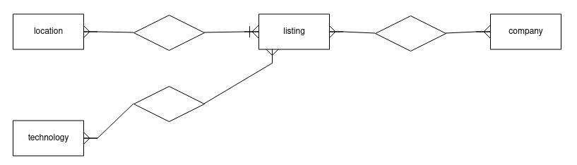

# devjobs.sh

## Description

Includes two applications: A crawler and a server.
The crawler retrieves comments on the "Who's Hiring" posts, parses them and inserts them into a database.
The server provides an HTTP interface to retrieve job listings by location and by used technologies.

### Longer description

Includes two applications: A crawler and a server.

The crawler first makes requests to the Hacker News API [0] for the "Who's Hiring" posts.
Then for each post it retrieves all the first level children, i.e. the comments.

Then it parses the retrieved text in various ways.
Technologies are identified by getting a list of tags via the stackoverflow API 
and doing a keyword search for them in the full text of a listing.
Locations are parsed using the expected format of the posts
"Company Name | Location 1, Location 2 | other information"
(this does not work very well, because the posters are very inconsistent.
In the future it might be good to migrate this to a keyword search as well)

Once parsed, the data is inserted into the postgres database.

[0] hackernews.api-docs.io/

## Interesting considerations

Effects are suspended in cats-effect `IO` 
All effects (in particular, http request and database transactions) are executed asynchronously.

## other documentation
 lists potential but currently not implemented improvements
